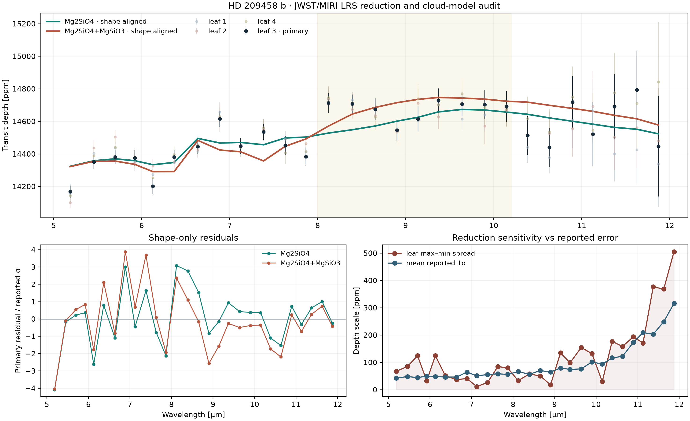

# HD 209458 b · JWST/MIRI reduction-sensitivity audit

**Independent reproducibility report by [Biswajit Jana](https://biswajit1999.github.io/Biswajit_Jana.github.io/)** · [Live report](https://biswajit1999.github.io/hd209458b-exoplanet-report/) · [ORCID](https://orcid.org/0009-0002-2411-1891)

This repository audits published JWST/MIRI LRS products for HD 209458 b. It
asks two narrow questions:

1. how strongly does the 5.2–11.9 µm spectrum change across four correlated
   leaves of one rule-based reduction tree; and
2. how closely do two publication-supplied PICASO/Virga cloud-model curves
   reproduce the shape of the primary leaf after one vertical alignment?

It does not rerun the light-curve reduction or atmospheric retrieval and does
not independently establish a magnesium-silicate detection.



## Results

The archived table contains 28 wavelength bins. Leaf 3—the spectrum used in
most retrievals in the source study—has an inverse-variance weighted mean
depth of **14,457.9 ppm**. This scalar is descriptive; it is not the atmospheric
result.

The mean max–min spread across the four correlated leaves is **122.2 ppm**
(median **85.0 ppm**). At **18 of 28** wavelengths, that spread exceeds the
mean reported 1σ error across leaves. Because all leaves share photons and most
processing decisions, this is a reduction-choice sensitivity diagnostic, not
a sample of independent systematic errors.

A predeclared broad-band contrast—8.0–10.2 µm minus 5.2–7.8 µm—is positive in
all four leaves and ranges from **267.2 to 294.1 ppm**. The quoted per-leaf
photon-only errors in `leaf_metrics.csv` exclude spectral covariance and
reduction-choice uncertainty, so their ratios must not be read as detection
significances.

After fitting one vertical offset to isolate shape, the publication-supplied
median Mg2SiO4 and mixed Mg2SiO4/MgSiO3 curves give descriptive chi-squared
values of **69.90** and **84.07** across 28 bins. These posterior-derived curves
were fitted by the source team to a larger combined dataset; comparing their
chi-squared values here is not an independent likelihood-ratio or Bayes-factor
test. The source paper's retrieval evidence, not this audit, supports its cloud
identification.

Machine-readable evidence:

- [`analysis_summary.json`](figures/analysis_summary.json)
- [`leaf_metrics.csv`](figures/leaf_metrics.csv)
- [`model_comparison.csv`](figures/model_comparison.csv)
- [`summary_statistics.csv`](figures/summary_statistics.csv)

## Data and provenance

All observational and model products come from the open Zenodo v1 record
[10.5281/zenodo.20089901](https://doi.org/10.5281/zenodo.20089901), supplementary
material for Chubb, Grant et al. (2026). The repository includes:

- the Figure 4 four-leaf transmission-spectrum table;
- median PICASO 3.0 + Virga 1.0 model products for Mg2SiO4 and mixed
  Mg2SiO4/MgSiO3 atmospheres; and
- the corresponding publisher-supplied README files.

Archive MD5 values, committed SHA-256 digests, column definitions, retrieval
dates, and correlation caveats are in [`data/SOURCE.md`](data/SOURCE.md).

## Reproduce

```bash
python -m pip install -r requirements.txt
python scripts/analyze_spectrum.py
python -m pytest -q
```

The analysis regenerates one figure and four tabular/JSON artifacts. Tests
exercise the weighted statistic, input validation, real-data regression values,
and both archived model comparisons.

## Inference boundary

- The repository starts from reduced spectra, not detector ramps or light
  curves; it cannot audit calibration, extraction, decorrelation, or transit
  fitting end to end.
- Spectral-bin covariance is unavailable in the compact Figure 4 table.
- The four leaves are correlated and are not exchangeable draws.
- The two cloud curves are posterior products, not held-out predictions.
- One fitted offset removes absolute-radius information from the shape audit.
- Molecular/cloud identification and evidence ratios belong to the source
  retrieval, which used ARCiS and PICASO/Virga with additional data.

## References

1. Chubb, K. L., Grant, D., et al. (2026), *Magnesium Silicate Clouds in
   the Atmosphere of HD 209458b from a Rule-Based Tree-Structured Data
   Reduction*, The Astronomical Journal; [arXiv:2606.00177](https://arxiv.org/abs/2606.00177).
2. Chubb, K. L., Grant, D., Wakeford, H., & Moran, S. E. (2026), supplementary
   dataset, [Zenodo 10.5281/zenodo.20089901](https://doi.org/10.5281/zenodo.20089901).
3. Charbonneau, D., et al. (2002), *Detection of an Extrasolar Planet
   Atmosphere*, ApJ 568, 377–384.
4. [NASA Exoplanet Archive: HD 209458](https://exoplanetarchive.ipac.caltech.edu/overview/HD_209458).

## License

MIT. The archived scientific products retain the terms stated by their source
record; cite the dataset and paper when reusing them.
